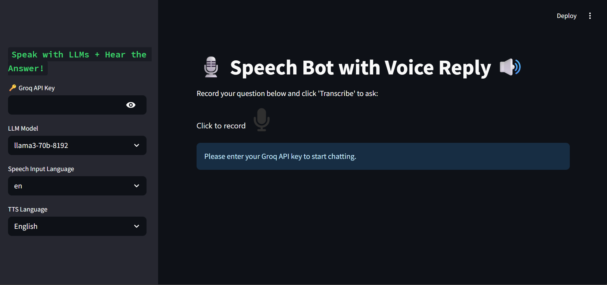

# 🎙️ Voice AI ChatBot 

## 🌟 Features
- **Voice Interface:** Record questions → Transcribe → Get voice+text responses
- **Multi-Language:** 12 input / 10 output languages supported
- **Groq-Powered:** Lightning-fast LLM responses (Llama3/Mixtral/Gemma)
- **Plug & Play:** Runs directly in browser via Streamlit

## 🚀 Quick Start
1. Get Groq API key from [console.groq.com](https://console.groq.com/)
2. Clone & setup:
```bash
git clone [your-repo-url] && cd [repo-name]
python -m venv venv && source venv/bin/activate  # Windows: venv\Scripts\activate
pip install -r requirements.txt
streamlit run app.py
```
##🛠️ Requirements
See requirements.txt for exact versions. Key dependencies:

-**streamlit** (Web UI)
-**audio-recorder-streamlit** (Voice recording)
-**gtts** (Text-to-speech)
-**speechrecognition** (STT conversion)
-**requests** (API calls)

## 🖥️ Application Interface Walkthrough

### 📸 UI Overview


**Key Components Explained:**
1. **Sidebar Controls (Left)**  
   - 🔑 API key input (secure password field)  
   - 🦙 Model selection dropdown (3 LLM options)  
   - 🌐 Dual-language selectors (input/output)  

2. **Main Interaction Area**  
   - 🎤 Microphone button (press-hold to record)  
   - 🔊 Audio player (appears after recording)  
   - 📝 Transcribe button (converts speech to text)  

3. **Chat Display**  
   - 💬 Conversation history (user/assistant turns)  
   - 🎧 Voice reply player (auto-generated per response)  
   - 📱 Mobile-responsive design
  
## 📜 License & Compliance

### GNU General Public License v3.0
**Key License Terms:**
- ✅ **Freedom to Use**: Run the software for any purpose
- ✅ **Freedom to Study**: Access and modify the source code
- ✅ **Freedom to Share**: Redistribute original or modified versions
- ✅ **Copyleft**: Modified versions must remain under GPLv3

**Your Obligations:**
1. Include the original [LICENSE](LICENSE) file
2. Disclose source code when distributing modified versions
3. State significant changes made to the original
4. Maintain copyright notices
